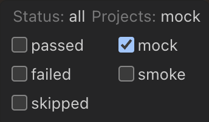

# Trading Hub

Merchandising UI for trading teams. Also known as the Merchandising Hub/Merch Hub

<!-- ALL-CONTRIBUTORS-BADGE:START - Do not remove or modify this section -->
[](#contributors-)
<!-- ALL-CONTRIBUTORS-BADGE:END -->


## Getting Started

### App Authentication registration for local development

Please follow this [doc](./docs/auth-local-dev.md) to set up auth.

An example .env file has been provided.

```bash
cp .env.example .env
```

### Running locally (recommended)

Trading Hub is a NextJS app. You will need [nvm](https://github.com/nvm-sh/nvm/blob/master/README.md#installing-and-updating) and [node](https://nodejs.org/en) installed locally to get started

```bash
nvm install

nvm use

npm install

npm run dev
```

Open [http://localhost:3000](http://localhost:3000) with your browser to see the result.


### Running with docker compose

<details>
<summary>Steps to run with docker</summary>
You will need docker installed on your laptop. Unfortunately M&S doesn't provide a license, you can either buy your own or use Podman or Rancher which are free alternatives. Docker however being on the market the longest has best developer experience.

#### Building image

In terminal cd to root directory and execute:

`docker-compose build merchandising-hub`

#### Running

In terminal cd to root directory and execute:

`docker-compose up -d  merchandising-hub`

`-d` runs the container in the background

#### Cleaning

When you are done, execute:

`docker-compose down`


To update the backend api docker image:

1. Find what is the latest version, unfortunately search-service is not producing that version number in a visible place so we need to do some digging, you can do it by:
  - navigate to [java-app-deploy.yml](https://github.com/DigitalInnovation/search-service/actions/workflows/java-app-deploy.yml)
  - Click on the most up to date run. 
  - Click on "Building Jar" tab on the left
  - Click on "========== Build and push Build Artifacts to artifact Store ==========" task
  - Scroll to the bottom
  - There should be log that says something like "#13 naming to docker.io/library/search-service-webapp:713 done"
  - In my case version is 713, but it might be different one in your case
  - Copy that version number
2. In `docker-compose.yml` find line that says `image: ghcr.io/digitalinnovation/search-service/search-service-webapp:712`
  - The number at the end will be different, just replace it with new version
3. Save, commit, push.

##### Docker failure locally

Some machines will not be able to run the docker image locally and will get the following error 

`application-dev The requested image's platform (linux/amd64) does not match the detected host platform (linux/arm64/v8) and no specific platform was requested`

1. Checkout search-service repo
2. Run `docker-compose build application-dev `
3. In trading hub docker, change application-dev image to `search-service-application-dev:latest` (commented out in code)
4. Build and run docker as per above steps
</details>


## Contributing

Before you can contribute to this repo, you must be able to sign your commits so they can be verified as a trusted source. See [this guide](https://onyx.engineering.mnscorp.net/getting-started/signing-commits.html) for an example of how to set this up.

### Pull requests

There are no precommit hooks, PR checks run against tests, type checking and code formatting.

Reviews are not dismissed on new commits, please rerequest a review if subsequent commits make significant code changes.

### API contract

Our agreed API contract with the backend team is stored in the [search-service](https://github.com/DigitalInnovation/search-service/blob/main/search-service-app/src/main/resources/static/search-merchandising.yml) repo and duplicated in this repo. It is used for all requests.

You can check or generate the code by running `npm run codegen` which uses the local [api.yml](src/libs/api/api.yml) file

### Feature flags

Any new features not ready for production use should be hidden behind a feature flag. We are using a cookie based solution with cookies set on http://localhost:3000/flags

Naming should follow `flagXXX` and default to false

### Tests

```bash
npm run test
```

Tests require 100% coverage for all files

```bash
npm run tdd
```

Run tests in watch mode for test driven development

### E2E tests

#### Running e2e tests locally

Playwright is set up for running e2e tests locally, to run it execute:

```bash
npm run test:e2e:ui
```

Click the green run button in the playwright UI, to run it without UI, execute:

```bash
npm run test:e2e
```

#### Mock tests

There are in depth e2e tests using mock data to test page interactions when editing a ruleset, these should be used for testing page behaviour before changes are saved

`NEXT_PUBLIC_AUTO_LOGIN='false'` is needed in the .env file to run tests without redirecting to AD login

These can be run by selecting the "mock" project in playwright



#### Smoke tests

There are [smoke tests](https://github.com/DigitalInnovation/trading-hub/actions/workflows/smoke-tests.yml) run each hour during the working day. The focus of these is for any data updates with the backend

```bash
NEXT_PUBLIC_AUTO_LOGIN='false'
SMOKE_TEST_TOKEN=XXX
```
These can be run by selecting the "smoke" project in playwright and setting the auth token (ask team for details)

### Production tests

Production tests are run to check AD login flow and loading of data to confirm the availability of prod

```bash
PROD_TEST_USER='y9786775@mnscorp.net'
PROD_TEST_USER_PASSWORD='XXX'
```

The yaccount used to login is `y9786775@mnscorp.net` and the tests log in via AD before running

### Code formatting

Prettier is used to format files, this can be set up in your IDE or by running `npm run format` before committing. Linting can be checked and updated by running `npm run lint:fix`

### PR checks

PR checks can be run locally with `npm run pr-validate` this runs all checks github runs on PRs

`NEXT_PUBLIC_AUTO_LOGIN='false'` should be set for this check

### Dependencies updates

Renovate is set up for the repo, all contributors can help with merging updates. Checks are scheduled outside of working hours.

### Snyk SAST

Snyk is configured trough external integration with github repository. To access the Dashboard navigate to: [app.snyk.io](https://app.snyk.io/org/a2654-trading-hub/project/1b93336f-39d2-42a0-ada4-d9611e54839c)

Trading-Hub needs to follow standard defined here: [technology-standards/security-tooling](https://github.com/DigitalInnovation/technology-standards/blob/main/docs/drafts/security-tooling.md)

Notes:

- Snyk is configured with scanning for dependencies and not code scanning due to the way license is purchased by M&S.
- Snyk is configured under yAccount owner.

#### Adding new Members

Please follow this doc: [add-members-to-the-existing-organisations](https://devopssec.engineering.mnscorp.net/Products/Snyk-Open-Source/how-to-get-access/#add-members-to-the-existing-organisations)

#### Snyk Support

Please follow this doc: [Support](https://devopssec.engineering.mnscorp.net/Support/)

### Azure oAuth app registration permissions

Take a look at [azure-oauth-app-registration](docs/azure-oauth-app-registration.md)

### VS Code

An example settings.json file is in the .vscode folder

### Storybook

Storybook is set up for the project, to run it execute:

```bash
npm run storybook:dev
```
It will run on port 6006, you can access it by going to [http://localhost:6006](http://localhost:6006)

## Deployments

During the 2024/5 golden quarter there is a manual step required for releasing. After merging to main and provided there is no code freeze go to your commit in the [release workflow](https://github.com/DigitalInnovation/trading-hub/actions/workflows/release.yml) and approve the production step, monitor the release and check your changes on production as usual

A [hotfix branch](https://github.com/DigitalInnovation/trading-hub/tree/hotfix) is set up should any releases be required during code freezes. To release a hotfix raise a PR against this branch, which will deploy to dev then production on confirmation. Hotfix branch is updated with code from main after successful production release from main

[Smoke tests](https://github.com/DigitalInnovation/trading-hub/actions/workflows/smoke-tests.yml) are run against dev every 15 minutes. These tests can be manually triggered from the workflow and is recommended to run after deploying to confirm tests pass

| Environment | URL                                                         |
| ----------- | ----------------------------------------------------------- |
| Dev         | https://dev-merchandising-hub.search.marksandspencer.app/   |
| Stage       | https://stage-merchandising-hub.search.marksandspencer.app/ |
| Prod        | https://merchandising-hub.search.marksandspencer.app/       |

## Run book

Please follow this [doc](./docs/run-book.md) for production issues.

## Play book

Please follow this[doc](https://jira-marksandspencer-app.atlassian.net/wiki/spaces/CGE/pages/362578145/Merchandising+Hub+Product+playbook) to understand how users can use Merchandising Hub

## Adding users

Please follow this [doc](./docs/user-access-managment.md)

## Contributors

<!-- ALL-CONTRIBUTORS-LIST:START - Do not remove or modify this section -->
<!-- prettier-ignore-start -->
<!-- markdownlint-disable -->
<table>
  <tbody>
    <tr>
      <td align="center" valign="top" width="14.28%"><a href="https://github.com/grahamlicence"><br /><sub><b>Graham Licence</b></sub></a><br /><a href="https://github.com/krzysztof-kabat-mns/trading-hub/commits?author=grahamlicence" title="Code">💻</a></td>
      <td align="center" valign="top" width="14.28%"><a href="https://github.com/Niko-guus"><br /><sub><b>Nikolay</b></sub></a><br /><a href="https://github.com/krzysztof-kabat-mns/trading-hub/commits?author=Niko-guus" title="Code">💻</a></td>
      <td align="center" valign="top" width="14.28%"><a href="http://www.jameswinfield.co.uk/"><br /><sub><b>James Winfield</b></sub></a><br /><a href="https://github.com/krzysztof-kabat-mns/trading-hub/commits?author=jamesthemullet" title="Code">💻</a></td>
      <td align="center" valign="top" width="14.28%"><a href="https://github.com/krzysztof-kabat-mns"><br /><sub><b>Krzysztof Kabat</b></sub></a><br /><a href="https://github.com/krzysztof-kabat-mns/trading-hub/commits?author=krzysztof-kabat-mns" title="Code">💻</a></td>
      <td align="center" valign="top" width="14.28%"><a href="https://github.com/rob-h-mns"><br /><sub><b>Rob Haley</b></sub></a><br /><a href="https://github.com/krzysztof-kabat-mns/trading-hub/commits?author=rob-h-mns" title="Code">💻</a></td>
      <td align="center" valign="top" width="14.28%"><a href="https://github.com/iyildiz-mns"><br /><sub><b>Idris Yildiz</b></sub></a><br /><a href="https://github.com/krzysztof-kabat-mns/trading-hub/commits?author=iyildiz-mns" title="Code">💻</a></td>
      <td align="center" valign="top" width="14.28%"><a href="https://github.com/nicwaters823"><br /><sub><b>Nicola Waters</b></sub></a><br /><a href="https://github.com/krzysztof-kabat-mns/trading-hub/commits?author=nicwaters823" title="Code">💻</a></td>
    </tr>
  </tbody>
  <tfoot>
    <tr>
      <td align="center" size="13px" colspan="7">
        
          <a href="https://all-contributors.js.org/docs/en/bot/usage">Add your contributions</a>
        </img>
      </td>
    </tr>
  </tfoot>
</table>

<!-- markdownlint-restore -->
<!-- prettier-ignore-end -->

<!-- ALL-CONTRIBUTORS-LIST:END -->
<!-- prettier-ignore-start -->
<!-- markdownlint-disable -->

<!-- markdownlint-restore -->
<!-- prettier-ignore-end -->

<!-- ALL-CONTRIBUTORS-LIST:END -->
