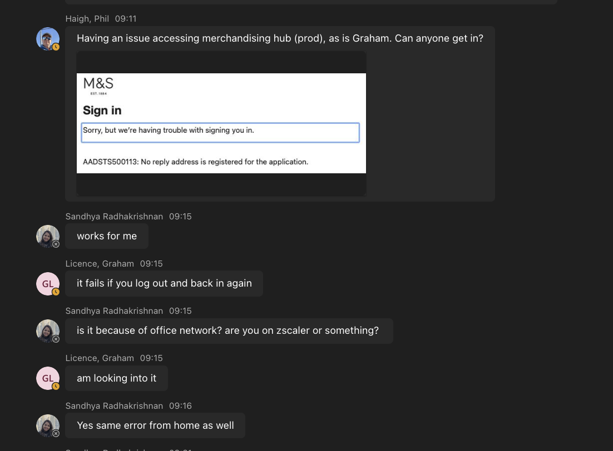
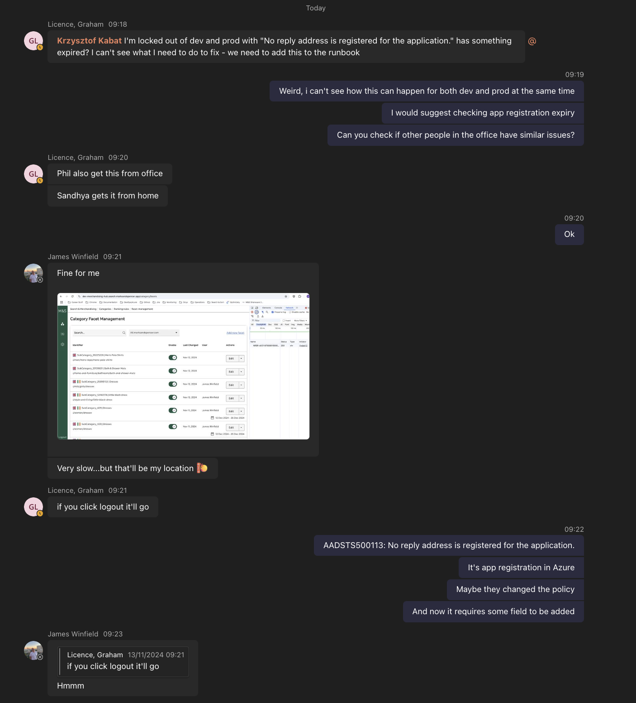
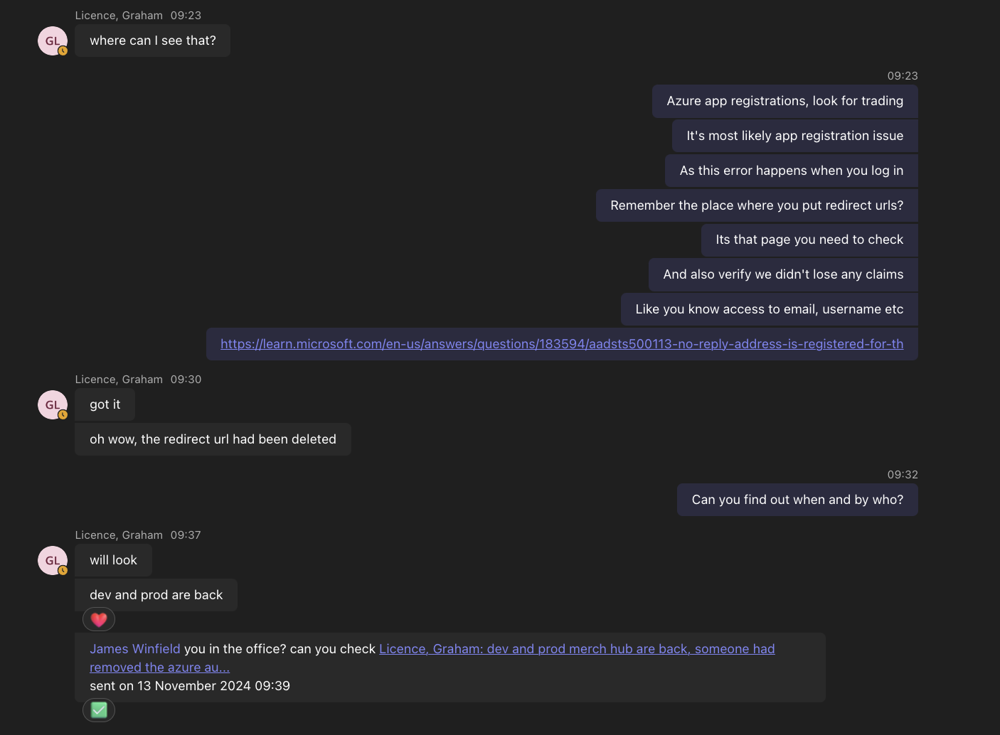
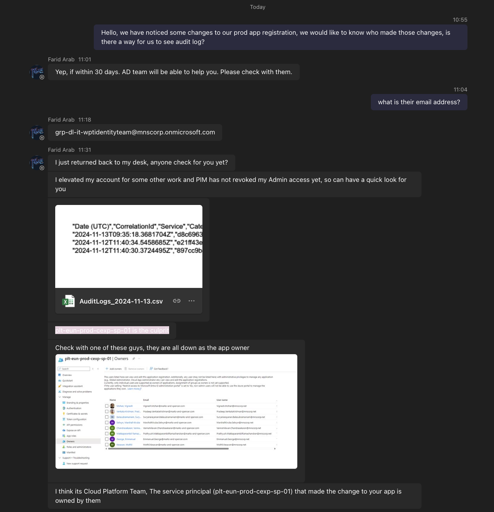
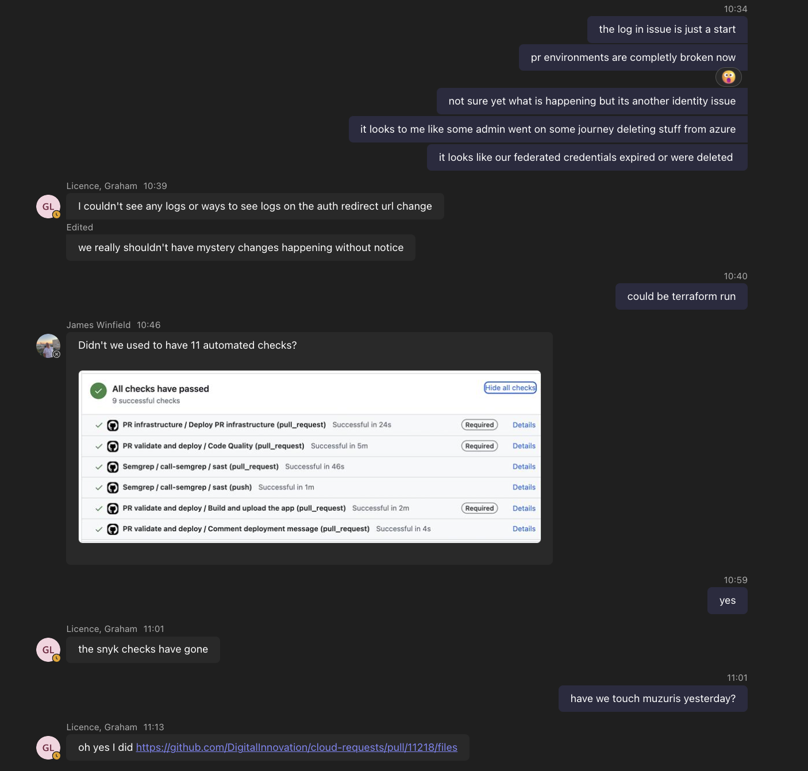

# Ecosystem builder removes auth redirect url and breaks both prod and dev pipeline

## Issue Summary

### Tuesday 12th November 2024

On Tuesday around 11:30 GMT a Graham Licence opens a [pull request](https://github.com/DigitalInnovation/cloud-requests/pull/11218/files) with the intent to add more people to the trading hub frontend team.

Pull Request once opened to his surprise is immediately merged after few seconds.

Once merged [Repository dispatch event creation](https://github.com/DigitalInnovation/cloud-requests/actions/runs/11796393499/job/32858151591) pipeline triggers, it then triggers remote workflow on `DigitalInnovation/terraform-ecosystem-builder` with `ecosystem-builder-request`

On `12 Nov 2024 11:33:37 GMT` `Ecosystem Builder` workflow begins to [run](https://github.com/DigitalInnovation/terraform-ecosystem-builder/actions/runs/11796400105/job/32858207405) and fails after 4 minutes with:

```
Error: A resource with the ID "5a15e74b-6cb9-445f-a98b-43ac951dd964/member/0a8e1d0b-bdfa-4963-94e8-0ed85a15215c" already exists
```

Graham Licence is unaware of this but following things just happened:

- Prod is now broken for any new authentication, due to `redirect_uri` being removed from app registration.
- Github repository is renamed from `trading-hub` to `trading-hub-release`(the old name)
- PROD release pipeline is broken.
- PR env pipeline is broken due to new service principal credentials that are not yet correctly injected into secrets.

For the rest of the day no PR is merged due to the sprint review meetings taking place after lunch. Nobody notices anything wrong.

### Wednesday 13th November 2024

On `12 Nov 2024 09:11:00 GMT` Phil Haigh writes on internal `Search and Sort Tech Chat
` teams channel:



Conversation then moves to `Search and Sort FE Engineers Chat` frontend channel:



It is verified that it is indeed a removed `redirect_uri` on both PROD and DEV app registrations.



Adding back `redirect_uri` in app registrations fixed the auth issue.

On `10:00:00 GMT` retro meeting starts and it will run until 11, during this time KK is looking trough logs and assessing damage.

KK decides to check who made a `redirect_uri` change by requesting audit log from admin.



Audit log shows that the change was made by terraform script. Muziris is now main suspect.



Going trough its logs reveals scale of damage.

The rest of the day is attempt to bring back pipelines, by fixing the ecosystem builder input file by Graham Licence, yields no results due to multiple conflicts between state file and existing state.

## Timeline

### Tuesday 12th November 2024

| Time  |     | Summary                                                                  |
| ----- | --- | ------------------------------------------------------------------------ |
| 11:30 |     | Incident begins                                                          |
| 11:30 |     | Graham Licence opens a pull request to add new users to trading hub team |
| 11:32 |     | Repository dispatch event pipeline starts executing                      |
| 11:33 |     | `Ecosystem Builder` workflow begins to run                               |
| 11:37 |     | `Ecosystem Builder` workflow fails, prod and pipelines are broken        |

### Wednesday 13th November 2024

| Time  |      | Summary                                                                                                                            |
| ----- | ---- | ---------------------------------------------------------------------------------------------------------------------------------- |
| 09:11 | MTTD | Phil Haigh detects issue with authentication                                                                                       |
| 09:18 | MTTA | Licence Graham acknowledges the issue and starts working on it                                                                     |
| 09:19 |      | KK is notified about issue and also starts working on it                                                                           |
| 09:37 |      | Authentication is fixed and prod auth is working again                                                                             |
| 10:00 |      | Retro meeting starts, auth issue is mentioned                                                                                      |
| 10:30 |      | KK tries to rebase a PR and finds more broken pipelines                                                                            |
| 10:46 |      | James notices missing PR validation checks                                                                                         |
| 10:55 |      | KK asks admin for audit log                                                                                                        |
| 11:01 |      | KK suspects terraform script to be the root cause                                                                                  |
| 11:31 | MTTI | KK receives audit log from admin and acknowledges that the issue is indeed caused by terraform client, muziris is now main suspect |
| 12:00 |      | Remaining of the day is spend on bringing the pipelines back to normal state                                                       |

### Thursday 5th December 2024

| Time  |      | Summary                                                                          |
| ----- | ---- | -------------------------------------------------------------------------------- |
| 09:34 | MTTR | KK resolved the issue by creating completely new pipeline for PR authentication. |

## Impact

Incident impacted:

- All user login attempts on https://merchandising-hub.search.marksandspencer.app/
- Developer ability to verify PR, nothing can be merged.
- Pipeline ability to release any change to PROD.

## Meantime reliability metrics (MTTRs)

### Wednesday 13th November 2024

- MTTD - 21 hour 41 minute
- MTTA - 7 minute
- MTTI - 2 hour 13 minute
- MTTR - 22 days

## How can we reduce the MTTRs by half?

- MTTD - We need smoke tests testing login.
- MTTA - We need alerting on those test failures
- MTTI - N/A
- MTTR - N/A

## Root Cause

1. Why were users unable to login?

`redirect_uri` was removed by terraform run by ecosystem builder. The remove was cause by terraform not being aware of manual changes to `redirect_uri` performed by trading hub team and changed it to a value from its state file.

2. Why the pipelines were broken?

Repository name was changed to trading-hub-release, secrets were updated partially.

3. Why secrets were updated partially?

Terraform does not do any transactions or rollbacks, it failed in the middle of applying the changes.

4. What was Licence Graham expecting ecosystem to do?

He was expecting that ecosystem builder will add new users to AD. He was also expecting that once a pull request is open there will be time to perform review of that PR by other engineers.

5. What ecosystem actually did?

Merged PR automatically with no consent from the author.
Erased `redirect_uri` for prod website.
Updated secrets partially.
Renamed repository to old name.
Broke while adding new users to AD, because they were already part of it.

## Resolution and recovery

New pipeline was introduced with architecture design available [here](../authentication.md). This new design is more resilient to changes on ecosystem level and it should prevent this issue happening in the future.

## Corrective and Preventative Measures

- New pipeline for authentication, detached from ecosystem builder.
- Separation of authentication and github access for DEV pipeline in upcoming ticket(LPN-2868).

## Alert Sensitivity

### Did an alert catch this issue shortly after it had started?

No.

### Was this issue worth being alerted for?

Yes.

### What modifications should be made to our alerts?

We need alerts for authentication.

## Links

-
