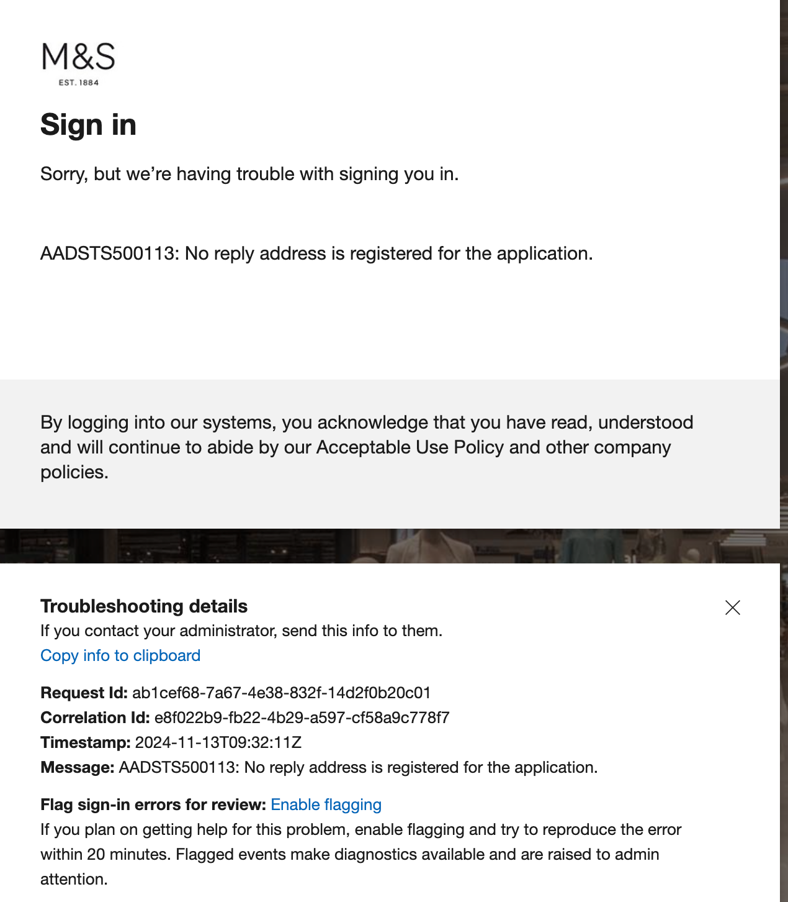
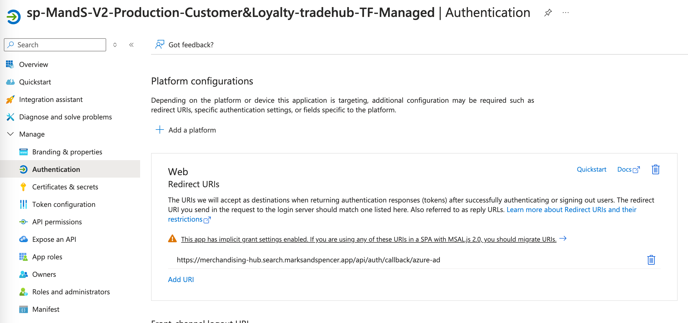

# Run book

## Overview

### Business overview

The application provides a UI for configuring results for Search Results Pages (SRPs) and Product Listing Pages (PLPs).

### Technical overview

This application is responsible for:

- Updating data provided by [search-service](https://github.com/DigitalInnovation/search-service)
- Previewing PLPs and SRPs

It is deployed in a Docker container to Azure.

#### Technologies

- [NextJS](https://nextjs.org/)
- [Typescript](https://www.typescriptlang.org/)

#### Dependencies

- [search-service](https://github.com/DigitalInnovation/search-service)
  failure of the search service will prevent use of the application, as apis are not cached

#### Deployment

The application is deployed via a [pipeline](../.github/workflows/pr-validate-and-deploy.yml) in Github actions.

## Service owners

| Name                 | Contact                                                                                                                                                                                                                                  |
| -------------------- | ---------------------------------------------------------------------------------------------------------------------------------------------------------------------------------------------------------------------------------------- |
| Search and Sort Team | [Teams link](https://teams.microsoft.com/l/channel/19%3Acd7050274735499eb5b50a6be31eaf33%40thread.tacv2/%5BSquad%5D%20Search%20-%20Incidents?groupId=09be67e3-2208-45f2-9eaf-41d6c22743bb&tenantId=bd5c6713-7399-4b31-be79-78f2d078e543) |
|                      | [E-mail](grp-search-and-sort@mnscorp.onmicrosoft.com)                                                                                                                                                                                    |

### Engineering Manager:

Toyin Butler

### Engineers:

Graham Licence  
Krzysztof Kabat  
James Winfield  
Nikolay Gushchin

### Product Manager:

Holly Morris

## System overview

### Operating hours

Trading Hub is available for use 24 hours a day, it is supported 9am - 6pm Monday to Friday.

#### Azure

- [prod eun](https://portal.azure.com/#@mnscorp.onmicrosoft.com/resource/subscriptions/7f2ff24f-150e-4686-a521-76c5fe21e6e2/resourceGroups/prod-trading-hub-v1-eun-layer3-rg/providers/Microsoft.Web/sites/prod-trading-hub-v1-eun-layer3-app/appServices)

- [prod euw](https://portal.azure.com/#@mnscorp.onmicrosoft.com/resource/subscriptions/7f2ff24f-150e-4686-a521-76c5fe21e6e2/resourceGroups/prod-trading-hub-v1-euw-layer3-rg/providers/Microsoft.Web/sites/prod-trading-hub-v1-euw-layer3-app/appServices)

- [dev eun](https://portal.azure.com/#@mnscorp.onmicrosoft.com/resource/subscriptions/26521dda-e1c7-4d57-abae-abe1ab30b4fc/resourceGroups/dev-trading-hub-v1-eun-layer3-rg/providers/Microsoft.Web/sites/dev-trading-hub-v1-eun-layer3-app/appServices)

- [PIM access list](https://portal.azure.com/#view/Microsoft_AAD_IAM/GroupDetailsMenuBlade/~/Members/groupId/99c29c95-2983-4829-bbac-82ebb28288d3)

## Configuration

### Trading Hub Access

Anyone with an M&S email can log in to the trading hub. To access data users need to be on an approved list, this is stored in a env var in the [search-service](https://github.com/DigitalInnovation/search-service)

## Monitoring

### Logs - Dynatrace

See [Dynatrace documentation](https://github.com/DigitalInnovation/trading-hub/blob/main/docs/dynatrace.md)

### Troubleshooting

In the event of an outage the most likely causes are:

- failed deployment
- api error from search service
- user is not authorised to use the trading hub

#### Scenario: In case of users not being able to sign in after being signed out, it could be that the redirect url is missing from Azure.

This is the error that they would receive:

This can be corrected by adding it back to the Authentication page:

The redirect for prod is: https://merchandising-hub.search.marksandspencer.app/api/auth/callback/azure-ad
For dev: https://dev-merchandising-hub.search.marksandspencer.app/api/auth/callback/azure-ad
For localhost: http://localhost:3000/api/auth/callback/azure-ad

#### Scenario: Deploy to Azure Web App failed

> The provided client secret keys for app '\*\*\*' are expired. Visit the Azure portal to create new keys for your app

Renew service principle password and replace `SP_PASSWORD` value in github actions

Dev: https://portal.azure.com/#view/Microsoft_AAD_RegisteredApps/ApplicationMenuBlade/~/Credentials/appId/2c640eb1-36ce-4c8a-be67-0559df1722f5

Prod: https://portal.azure.com/#view/Microsoft_AAD_RegisteredApps/ApplicationMenuBlade/~/Credentials/appId/79325e76-57c8-4d1d-83b9-08e3a5a14760

### Incident management

[Pagerduty Merchandising Hub Escalation](https://mands.pagerduty.com/escalation_policies#P4WPYI5)

### Hotfix Release Process

Create your branch from the [hotfix branch](https://github.com/DigitalInnovation/trading-hub/tree/hotfix).

Make your necessary changes, commit and push the code.

Create a pull request, with the base branch as [hotfix branch](https://github.com/DigitalInnovation/trading-hub/tree/hotfix).

If there is a code freeze, or there are other unreleased changes on the main branch, do not merge in the main branch, and do not follow the "resolve conflicts" process on your pull request.

Note that merging into the hotfix branch does not require an approval, but the usual code review process should be followed if possible. This is so that an emergency release can be done out of office hours.

Merge your pull request. This will trigger the [Hotfix Release workflow](https://github.com/DigitalInnovation/trading-hub/blob/main/.github/workflows/hotfix.yml).

This will deploy to dev so that you can test your fix.

To deploy to prod, you will need to provide approval within the Hotfix Release Github Actions flow.

Once this is deployed, you will then need to create another pull request, this time to merge your branch into the [main branch](https://github.com/DigitalInnovation/trading-hub/tree/main).

Do not merge the hotfix branch into main if there are unreleased changes on main (ie during times of code freeze).
