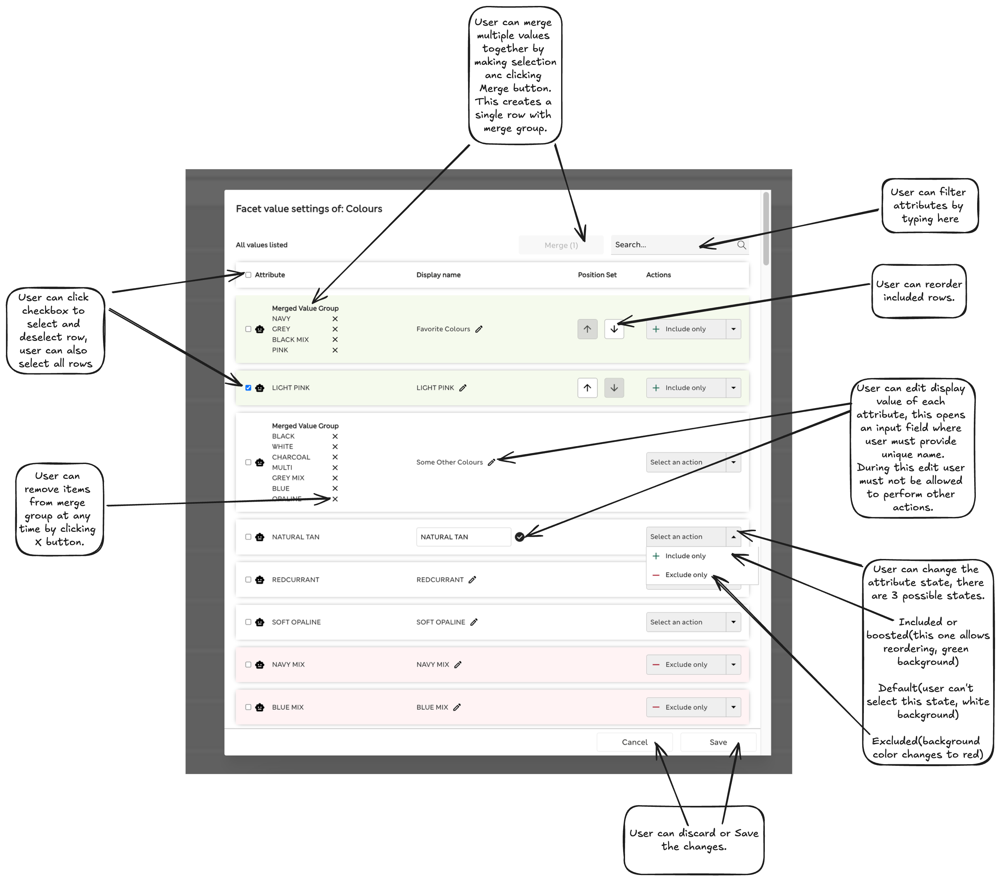
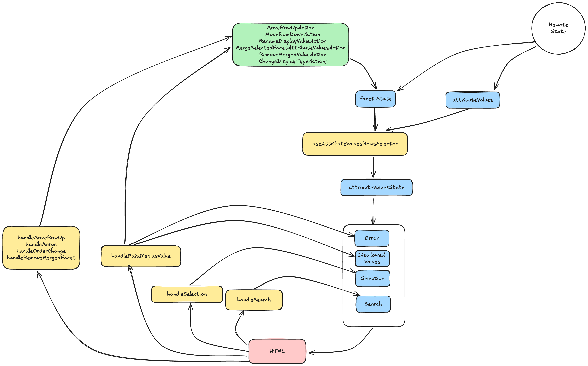

## Edit Facet

### Features Overview

### State management

High level state management diagram:

This component is using combination of `useReducer` and `useState`.

The reason why for facet it is using reducer is due to complexity of updates of that state, it could have been done with `useState` but the result would be that all of the logic would end up in handlers, which are hard to test.

The main goal is to update `facet` state so that we can send it back to the server. This state is a copy of state from the server. On top of it we have local state that is temporarily persisted when modal is open, like:
- `error` - stores state about current editable row error state, for example value is no unique.
- `Disallowed Values` - stores values we know are not allowed after checking with the backend.
- `Selection` - stores state of which rows are selected.
- `Search` - state of current search input value.

Event handlers job is to either update local state or facet state. Facet state is updated by sending action objects to reducer. This way we can separate logic for changing the state from the logic that makes decision of updating the state.
